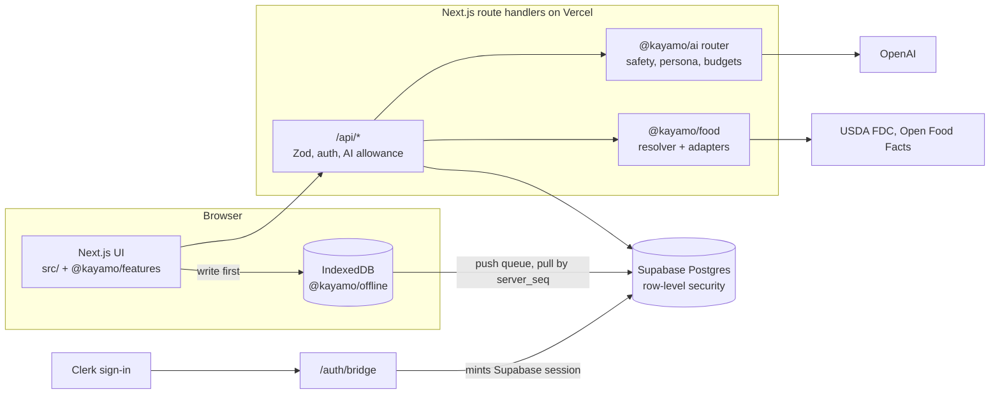

# KayaMo

**KayaMo is a live meal, workout and daily-plan tracker, with Filipino food and Taglish supported from the start. Its AI companion, Lis, drafts tasks, goals and food entries from plain words (or, for food, a photo), and nothing is saved until you confirm. Nutrition numbers come from sourced food data (USDA FoodData Central, Open Food Facts and a curated Philippine dataset), never from the model.**

**Live:** [www.kayamo.fit](https://www.kayamo.fit). You can try the demo in your browser without an account.


---

## Features

- **Lis proposes, you confirm.** Talk to Lis in plain language and it answers with proposal cards: a task, a goal, a food entry. Every write needs your approval. You decide what Lis may read across five areas: goals and planning, food and workouts, saved memories, faith, and identity. A crisis classifier runs before any model call. It is rule-based, costs nothing, and is never limited by quota.
- **Four ways to log food**
  1. **Command palette** (`⌘K` / `Ctrl+K` from any screen, or the `+` Log sheet): search, pick a portion and a meal, log it, and undo if needed.
  2. **Worldwide search** on the Foods page (needs an account): queries USDA FoodData Central and Open Food Facts by name or barcode, and shows where each result came from. On the live site, USDA results are pending an API-key fix.
  3. **Tell Lis** what you ate. Lis proposes a `log_food` action. Once you confirm, the app looks up the nutrition in the food catalog. The model never supplies the numbers.
  4. **Send Lis a photo** (JPEG/PNG/WebP). Lis names the dishes and household portions it sees and never outputs calories. You confirm before anything is logged.
- **Filipino food and Taglish.** A hand-curated Philippine core dataset (kanin, sinangag and more) has Tagalog aliases and household servings such as "1 tasa" and "rice-cooker cup", and search matches the Tagalog names. Lis can reply in English or Taglish, or match how you write. The safety classifier also covers Filipino and Taglish phrasing. A Taglish-aware food-parser endpoint exists but is not wired into the UI yet. English is the default.
- **Nutrition numbers you can trace.** Every nutrition value is stored with a `source` and a `confidence`. The LLM only extracts text and quantities. Calorie targets have minimum floors enforced in code and by a database trigger, not by prompts. A Verify screen reviews food data with an Atwater (4/4/9) check that compares macros against calories.
- **Local-first writes.** Every entry is written to the browser's IndexedDB first. A queue then syncs it to Postgres, retrying with backoff after failures. Each account gets its own local database, and the diary loads from the device. There is no service worker yet, so the app needs a connection to open; once it is open, entries are saved on the device and synced later.
- **A daily loop without guilt.** Home shows a greeting from Lis (a pure function, with no model call), a calorie ring, a meals counter and a streak. Goals are "Released", never "failed". Life charts your records in hand-drawn SVG. Grove holds XP, milestones and personal records, and XP never goes down. A CI check keeps shame words ("cheat", "guilty", "burn it off") out of prompts and UI copy.
- **No-account demo.** It runs entirely in your browser and demo entries stay on your device. AI features and worldwide search require an account.

## How it works



**How a food entry moves through the system**

1. You search in the palette, or tell Lis or show it a photo.
2. If a model is involved, it returns a Zod-validated structure containing names and quantities only.
3. `@kayamo/food` ranks candidates in this order: your own foods, the Philippine core set, barcode hits, cached rows, then live USDA and Open Food Facts results. Foods you log often get a boost. Each candidate keeps its source and confidence.
4. You confirm. The entry is written to IndexedDB immediately and synced when the device is online.

**Sync.** Clients use last-write-wins on `updated_at`. Pulls use a per-user `server_seq` cursor that the server assigns, so a later sequence number can never commit ahead of an earlier one. Deletes are tombstones, and a delete always wins over stale data. A 401 response pauses the queue without dropping writes. The full contract is in [`packages/offline/README.md`](packages/offline/README.md).

**Auth.** Clerk handles accounts and the sign-in UI. After sign-in, `/auth/bridge` creates the matching Supabase session on the server. Row-level security, sync and the test suite therefore depend only on Supabase's `auth.uid()`.

**AI guardrails.** All model calls go through one router in `@kayamo/ai`. That router validates output with Zod, enforces a per-user daily allowance and spend budget, applies timeouts, and records telemetry without prompt, image or health content. The Lis voice has its own evals:

- a deterministic rubric that catches robotic phrasing and structural drift;
- an opt-in live tier that runs a pairwise LLM judge against 28 frozen baseline conversations.

### Repository layout

| Path | Responsibility |
| --- | --- |
| `src/` | Routes, navigation and composition (Next.js App Router). No domain logic. |
| `packages/features` | Screen logic, data hooks and components (food, Lis, goals, planner, gym) |
| `packages/ai` | Every model call: router, Lis persona, safety classifier, context permissions, evals |
| `packages/food` | Food resolution and ranking, USDA and Open Food Facts adapters, portions, label-OCR schema |
| `packages/offline` | Dexie schema, optimistic writes, sync queue, pull and merge |
| `packages/db` | Drizzle schema, typed queries, Supabase clients (the service role stays server-only) |
| `packages/core` | Pure domain logic: TDEE, targets and calorie floors, weight trend, training progression |
| `packages/ui` | Liquid Glass design tokens and shared primitives |
| `supabase/migrations` | 23 hand-written SQL migrations, including row-level security |
| `data/` | Curated Philippine core food dataset and the gym and planner knowledge bases |
| `e2e/` | Playwright specs |

Engineering rules for contributors and coding agents are in [`AGENTS.md`](AGENTS.md).

## Tech stack

| Layer | Tools |
| --- | --- |
| App | Next.js 16 (App Router, Server Components), React 19, TypeScript (strict) |
| Styling | CSS Modules over a custom Liquid Glass token system, Tailwind v4 (base and theme tokens), Phosphor icons, hand-drawn SVG charts |
| Auth | Clerk, bridged to Supabase Auth |
| Data | Supabase Postgres with row-level security, Drizzle ORM, supabase-js |
| Offline | Dexie (IndexedDB) with a custom sync queue |
| AI | OpenAI via the Vercel AI SDK, Zod-validated structured outputs |
| Food data | USDA FoodData Central, Open Food Facts, curated YAML dataset |
| Testing | Vitest, Playwright (Chromium, Firefox, WebKit), axe-core |
| CI/CD | GitHub Actions, Vercel |
| Tooling | pnpm workspaces, ESLint 9, Prettier |

## Getting started

**Prerequisites:** Node.js 22 (the version CI uses), pnpm 9, and Docker (for a local Supabase stack).

```bash
pnpm install
cp .env.example .env.local

npx supabase start               # local Postgres, Auth and API; prints URL and keys
npx supabase db reset --local    # replay every migration from an empty database
pnpm exec tsx scripts/seed.ts    # optional: seed foods and reference data (needs DATABASE_URL)

pnpm dev                         # http://localhost:3002
```

Copy the API URL, anon key, service-role key and database URL that `supabase start` prints into `.env.local`. With no keys at all, the app still builds and **Explore the demo** works. In development, `/login` also offers a skip-login that signs in a local test user (this needs `SUPABASE_SERVICE_ROLE_KEY`).

| Variable | Used for |
| --- | --- |
| `NEXT_PUBLIC_SUPABASE_URL`, `NEXT_PUBLIC_SUPABASE_ANON_KEY` | App data |
| `SUPABASE_SERVICE_ROLE_KEY` | Server only: dev skip-login, the Clerk bridge, AI routes |
| `DATABASE_URL` | Seed script. Must be a local host unless `KAYAMO_ALLOW_REMOTE_DB=1` |
| `NEXT_PUBLIC_SITE_URL` | Auth redirects (`http://localhost:3002` locally) |
| `OPENAI_API_KEY`, `MODEL_NANO` / `MODEL_SMALL` / `MODEL_VISION` / `MODEL_COACH` | Lis and photo observation. Without a key, the food parser falls back to rules |
| `USDA_FDC_API_KEY`, `OFF_USER_AGENT` | Worldwide food search |
| `NEXT_PUBLIC_CLERK_PUBLISHABLE_KEY`, `CLERK_SECRET_KEY` | Sign-in. Optional locally: without them, `/login` says sign-in is not configured |

### Scripts

| Command | What it does |
| --- | --- |
| `pnpm dev` / `pnpm build` / `pnpm start` | Dev server (Turbopack), production build (webpack), production server, all on port 3002 |
| `pnpm typecheck` / `pnpm lint` | TypeScript and ESLint across the app and every package |
| `pnpm test` | Vitest unit tests across the app and every package |
| `pnpm test:e2e` | Playwright on Chromium, Firefox and WebKit. Starts the dev server; run `pnpm exec playwright install` once first |
| `RUN_DB_TESTS=1 pnpm test:db:integration` | RLS, sync-sequence and PostgREST tests. Use only against a disposable local Supabase |
| `pnpm check:copy` | Checks prompts and UI copy for banned vocabulary |
| `pnpm test:security` | Checks security-relevant dependency compatibility |
| `pnpm ph-core:build` | Validates and upserts the Philippine core food dataset (`--check` validates only) |
| `pnpm --filter @kayamo/ai eval:live` | Live Lis voice evals (opt-in, spends API credit) |

### Quality gates

GitHub Actions runs three jobs on every push and pull request:

1. **check:** typecheck, lint, unit tests, banned-copy check, dependency security, `pnpm audit --prod`, production build.
2. **database-integration:** starts a disposable Supabase, replays all migrations, then runs the RLS and sync integration suites, the offline sync regressions and the full Playwright suite.
3. **production-e2e:** runs the Playwright suite against `next build` + `next start`, because the dev and production bundlers behave differently.

The Playwright suite also checks security headers, axe accessibility and a JavaScript bundle budget.

## Development and deployment

- **Hosting:** Vercel builds from the repository root. Merging to `main` deploys.
- **Environment:** set the variables above in Vercel. Production sign-in needs a Clerk production instance for `kayamo.fit`.
- **Supabase Auth URL configuration:** set the Site URL to `https://www.kayamo.fit` and add redirect URLs for `/auth/callback` on both `www` and the apex domain (listed in [`.env.example`](.env.example)). The apex `kayamo.fit` redirects to `www`.
- **Migrations:** the Supabase CLI is the only migration runner. Add a numbered file under `supabase/migrations/` and replay it locally. Then, with a backup taken, run `npx supabase db push --linked --dry-run` followed by `npx supabase db push --linked`.
- **Hosted smoke test:** `pnpm test:e2e:hosted` runs the Playwright suite against https://www.kayamo.fit.

## Project status and roadmap

KayaMo is live at [kayamo.fit](https://www.kayamo.fit) and under active development. The launch checklist lives in [`docs/RELEASE.md`](docs/RELEASE.md).

**Shipped**
- Liquid Glass redesign
- Progress charts, guidance and motion (all respect reduced-motion settings)
- Lis greeting on Home and the readings row
- Clerk sign-in

**Next**
- Profile and target write path
- Onboarding screens
- Lis presets and verbosity settings
- A Lis tool loop: food lookup, profile proposals, and goals with a first step
- Meters on Food, Goals and Grove
- A setting to hide counters

**Built but hidden from v1 navigation**
- Gym: live sessions, rest timer, exercise knowledge base, AI consult
- Todos: timeline planner, AI day planning

Both routes still work. They return to the navigation once they are restyled to match the rest of the app.

**Out of scope for this repo:** native iOS and Android (a separate mobile repository), social Circles, billing, and push notifications.

## Credits

Designed and built by **Rovince Eduvane** ([LinkedIn](https://www.linkedin.com/in/rovince-eduvane)).

Food data comes from [USDA FoodData Central](https://fdc.nal.usda.gov) (CC0) and [Open Food Facts](https://world.openfoodfacts.org) (ODbL). Values in the Philippine core dataset are derived from USDA ingredient data, and each entry records the recipe it assumes.
